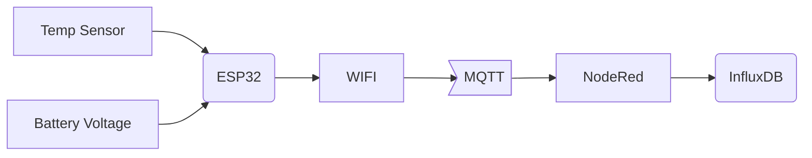
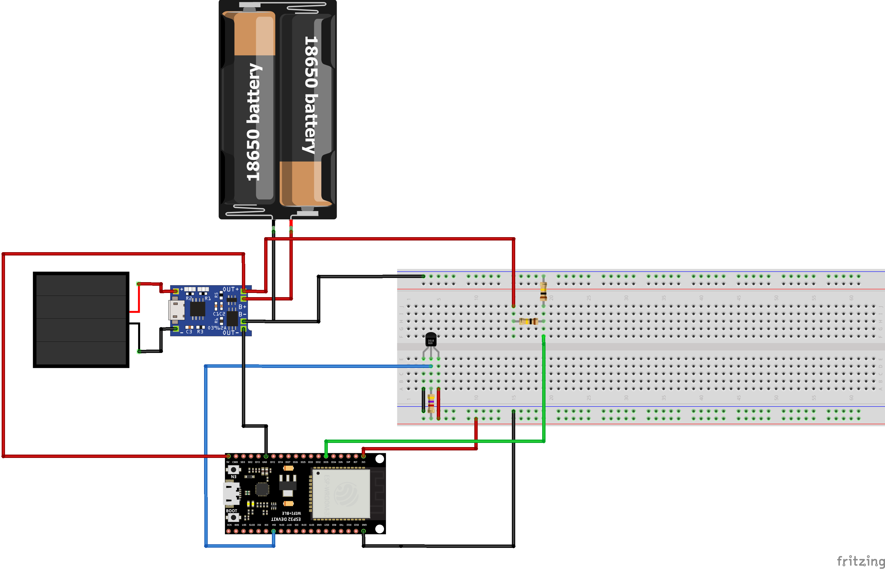

# Photovoltaik Temperatursensor

## Projektbeschreibung:

Es soll die Temperatur meines Schwimmteiches in definierten Intervallen in eine Datenbank geschrieben werden. Um keine weiteren Stromkabel verlegen zu müssen wird das System durch eine PV Zelle versorgt und verwendet Deep Sleep states des ESP32.

## Systemübersicht:

## Hardware:

## Software (ESP32):

## NodeRed Flow:

## NodeRed Visualisierung:

